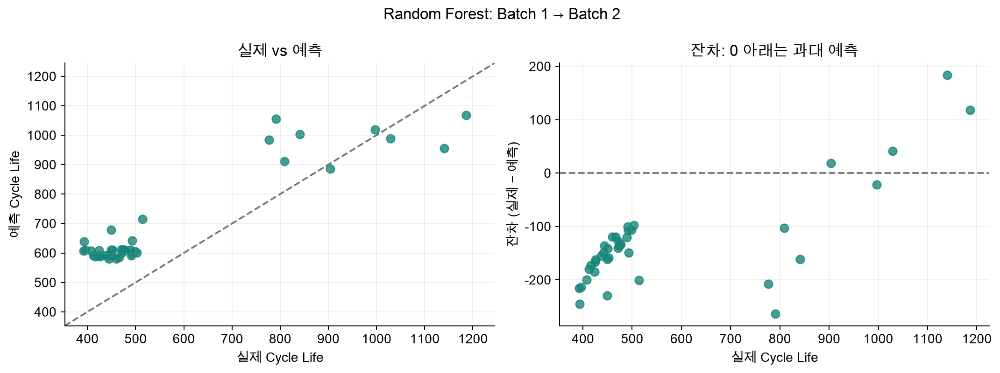

# ESS 배터리 수명 예측

**배터리는 충·방전을 반복하면서 용량이 감소하고 SOH가 하락하여 EOL에 도달한다.** 본 프로젝트는 초기 운용 데이터로 최종 `cycle_life`를 예측하여 EOL 도달 시점과 교체 계획을 사전에 검토하는 것을 목적으로 한다.

ESS의 배터리 교체는 설비 비용 관리의 주요 고려 사항이다. 수명 예측 결과를 교체 계획의 보조 정보로 활용함으로써 불필요한 조기 교체를 줄이고 비용 관리의 효율성을 높이고자 한다.

ESS는 BMS와 EMS를 통해 배터리 상태를 감시하고 충·방전 전략을 결정한다. 현재 상태와 함께 향후 열화를 예측하여 안정적인 운영과 충·방전 전략 검토에 활용하고자 한다. 다만 본 프로젝트는 실험실 셀 데이터 기반 연구이며, 실제 ESS 교체 시점의 직접적인 판단에는 추가 검증이 필요하다.

## 프로젝트 개요

- **데이터셋:** MIT–Stanford Battery Dataset 관련 배치 데이터 (Severson et al., Nature Energy, 2019)
- **학습 데이터:** Batch 1 (`2017-05-12`), 46개 셀
- **평가 데이터:** Batch 2 (`2018-02-20`), 유효 수명 라벨을 가진 39개 셀
- **EDA 데이터:** Batch 1·2·3. Batch 3은 `2018-04-12` 데이터이다.
- **태스크:** Regression — 초기 100사이클 정보로 최종 Cycle Life 예측
- **최종 모델:** Random Forest Regressor
- **주 평가 지표:** MAPE

## 파일 구조

GitHub에 공유하는 주요 파일은 다음과 같다. 성능·검증 근거가 담긴 CSV·JSON·보고서와 그래프는 함께 관리한다.

```text
.
├── data/
│   └── README.md                  # 원본 파일 안내·전처리 기준
├── notebooks/
│   ├── 01_EDA.ipynb
│   ├── 02_feature_engineering.ipynb
│   └── 03_modeling.ipynb
├── src/
│   ├── __init__.py
│   ├── preprocess.py
│   ├── features.py
│   └── train.py
├── results/
│   ├── model_performance.csv      # 최종 모델 성능
│   ├── main_summary.csv           # 후보별 Batch 1 개발 CV 성능
│   ├── validation_test_summary.csv # CV·Hold-out·Test 및 Gap
│   ├── batch1_holdout_split.csv    # 개발/Hold-out 분할 목록
│   ├── main_holdout_predictions.csv # 독립 Hold-out 예측
│   ├── selected_test_predictions.csv
│   ├── selection_manifest.json   # 분할·피처·버전·파라미터
│   ├── report.md                 # 결과 해석
│   ├── eda/                      # EDA 표·답변
│   └── figures/                  # EDA·피처·모델링 그래프
├── .gitignore
├── requirements.txt
└── README.md
```

## 환경 설정

검증 환경은 Python 3.11.15이다. 기존 `.venv`를 그대로 사용할 수 있다. 새 환경을 만들 때는 다음 명령을 실행한다.

```bash
git clone https://github.com/jihun-24k/ess-battery-analytics.git
cd ess-battery-analytics
uv venv --python 3.11
uv pip install -r requirements.txt
```

VS Code에서 `.venv`를 Jupyter 커널로 선택한 뒤 노트북을 01 → 02 → 03 순서로 Run All을 실행한다. 노트북이 프로젝트 루트를 찾아 `src`를 import하므로 프로젝트 루트와 `notebooks/` 양쪽에서 실행할 수 있다. 원본 위치·표본 제외 기준은 [data/README.md](data/README.md)에 설명하였다.

그래프 없이 피처 생성과 모델링을 실행하려면 프로젝트 루트에서 다음 명령을 사용한다.

```bash
.venv/bin/python -m src.features
.venv/bin/python -m src.train
```

macOS의 새 환경에서 XGBoost가 `libomp.dylib` 로딩 오류를 내면 OpenMP 런타임 설치가 필요하다. 현재 프로젝트 `.venv`에서는 XGBoost 실행과 저장 모델 재로딩을 확인하였다.

## 파일 역할

| 파일 | 역할 |
|---|---|
| `src/preprocess.py` | MATLAB 선택 로딩, 실제 사이클 정렬·검증, 초기 요약/전류/ΔQ 처리, EDA 열화곡선 계산 |
| `src/features.py` | 초기 피처 추출, Policy 파싱, 품질·라벨 점검, X/y/변형 데이터 저장 |
| `src/train.py` | 후보 정의, Batch 1 내부 튜닝, Batch 2 평가·최종 선정, 모델·성능·진단 저장 |
| `01_EDA.ipynb` | 수명 분포, 열화·knee 후보, ΔQ, Policy, 상관 및 배치 비교와 해석 |
| `02_feature_engineering.ipynb` | 고정 피처 정의와 품질 기준 확인, X/y 생성·점검 |
| `03_modeling.ipynb` | 세 후보 비교, 선정 근거, 테스트 오차·잔차·민감도·논문 비교 |

노트북은 해석·표·그래프를 담당하고, 반복되는 데이터 처리와 학습 로직은 `src`에서 관리한다. 아카이브의 기존 소스는 당시 경로를 사용하는 과거 실험 자료이다. 현재 실행은 위 세 노트북과 `src`를 사용한다.

## EDA

### Cycle Life 분포

Batch별 평균 수명은 Batch 1 약 **845**, Batch 2 약 **566**, Batch 3 약 **1,060사이클**로 차이가 나타났다. Batch 2는 500사이클 미만 셀이 **28/39개(71.8%)**였으며, Batch 3은 1,000사이클 초과 셀이 **23/44개(52.3%)**였다.

**핵심 발견:** 배치별 수명 분포가 크게 달라 동일한 조건의 표본으로 보기 어렵다. 구조·충전 Policy·수명 라벨의 차이가 관찰된 수명 차이와 관련될 가능성이 있으며, 배치 간 일반화 검증이 필요하다.

### 열화 곡선 분석

세 Batch 모두 관측 구간의 앞 30%보다 뒤 30%에서 용량 감소 속도가 빨랐다. Knee 후보 중앙값은 Batch 2 약 **362**, Batch 1 약 **627**, Batch 3 약 **803사이클**로 나타났다.

**핵심 발견:** 평균 수명이 긴 배치에서 Knee 후보가 늦게 나타나는 경향을 확인하였다. 다만 관측 구간의 20~80% 안에서 탐색한 후보이며, 특히 Batch 3은 43개 후보 중 20개가 탐색 상한에 해당하므로 정확한 물리적 급격 열화 시작점으로 확정하지 않는다. 전체 열화곡선과 Knee는 해석에만 활용하며 초기 예측 피처에 포함하지 않는다.

### ΔQ(V) 곡선 분석

`ΔQ(V) = Q100(V) − Q10(V)`로 초기 방전곡선의 변화를 비교하였다. 상대적으로 단수명인 셀에서 변화가 크고 음의 방향으로 나타나는 경향을 확인하였다. ΔQ log variance와 Cycle Life의 Pearson 상관계수는 Batch 1 **−0.886**, Batch 2 **−0.902**, Batch 3 **−0.702**였다.

**핵심 발견:** ΔQ log variance는 세 Batch에서 일관된 음의 상관을 보여 초기 수명 예측의 핵심 피처 후보로 선정하였다. Batch 1·3에는 500사이클 미만 셀이 없어 장·단수명 비교 시 상·하위 사분위를 사용하였으며, Batch 2의 고정 임계값 비교와 구분하였다.

### 충전 속도(C-rate)와 수명의 관계

충전 Policy별 평균 수명에 차이가 나타났으며, 실측 충전 전류와 수명의 관계는 배치마다 달랐다. Batch 3의 사이클 최대 전류 평균과 수명의 상관은 전체 **−0.708**에서 Policy별 평균을 제거한 후 **−0.045**로 감소하였다.

**핵심 발견:** 높은 C-rate 하나만으로 짧은 수명을 설명하기 어렵다. 전류 전환 시점과 조합을 포함한 전체 충전 Policy를 피처로 표현할 필요가 있다. 관찰된 상관을 충전 전략의 인과 효과로 해석하지 않는다.

### 추가 확인 사항

평균 온도와 최고 온도, 여러 ΔQ 파생변수 사이에 높은 상관이 나타나 다중공선성 가능성을 확인하였다. Batch 2의 `newstructure` 그룹은 상대적으로 장수명인 셀과 연결되어 구조 그룹 차이도 해석 시 고려하였다.

**핵심 발견:** 중복 피처를 줄이고 배치·구조·충전 Policy 차이를 고려한 피처 설계가 필요하다. 셀 ID·Batch ID·구조 표식은 현재 예측 X에 포함하지 않는다.

위 EDA 수치는 유효 수명 라벨을 가진 **46/39/44개** 기준이다. 피처 생성에서는 Batch 3 품질 점검 대상 4개를 제외하여 **46/39/40개**를 사용하였다. EDA와 모델링의 표본 범위를 구분하였다. [EDA 답변](results/eda/answers.md), [배치 비교 결과](results/eda/batch_comparison.csv)

## 가설 설정

### 가설 1. 초기 ΔQ 변화가 클수록 배터리 수명은 짧을 것이다

초기 10~100사이클의 ΔQ log variance가 세 Batch에서 `cycle_life`와 강한 음의 상관을 보였다. 초기 방전곡선 변화가 클수록 수명이 짧을 가능성이 있다고 판단하여 ΔQ log variance를 핵심 예측 피처로 활용하였다. 실제 예측력은 별도의 모델 평가로 확인하였다.

### 가설 2. 단순 충전 전류보다 충전 Policy 전체가 수명 차이를 더 잘 설명할 것이다

충전 전류와 수명의 상관은 배치마다 달랐으나 Policy별 평균 수명에는 차이가 나타났다. 이에 최대 C-rate 하나보다 **1차 C-rate·전환 SOC·2차 C-rate**로 표현한 충전 전략이 수명 차이를 더 잘 설명할 것이라는 가설을 설정하였다. 이 가설은 피처 설계의 근거이며 단일 전류 피처 대비 성능 우위나 인과 효과가 확정되었다는 의미는 아니다.

## Modeling

### 피처 엔지니어링 전략

초기 100사이클 내에서 계산 가능하고 수명과의 관계가 확인된 변수 및 충전 조건을 중심으로 피처를 선정하였다.

| 피처 | 변수명 | 정의 및 선정 근거 |
|---|---|---|
| ΔQ log variance | `delta_logvar` | 동일 전압 격자의 Q100−Q10 분산에 log10을 적용하였다. 세 Batch에서 수명과 일관된 음의 상관을 보여 핵심 열화 피처로 선정하였다. |
| 1차 C-rate | `policy_C1` | 충전 Policy를 분해한 첫 번째 충전 속도이다. |
| 전환 SOC | `policy_switch_SOC_pct` | 충전 전류가 전환되는 SOC(%)이다. |
| 2차 C-rate | `policy_C2` | 전환 이후 두 번째 충전 속도이다. |

Charging Policy 문자열은 수치형 조건으로 분해하였다. 종속변수는 제공된 **`cycle_life`**이며 ln(y)로 학습한 뒤 exp로 역변환하였다. 결측 대체 및 Ridge의 스케일링은 Pipeline 내부에서 각 학습 fold에만 적용하였다.

### 모델 선택 및 근거

| 후보 모델 | 선정 근거 및 역할 |
|---|---|
| Ridge Regression | 초기 피처와 로그 수명 사이의 선형 관계를 확인하는 기준 모델이다. 규제로 계수의 불안정성과 다중공선성 영향을 완화한다. |
| Random Forest Regressor | 초기 열화 피처와 충전 조건 사이의 비선형 관계 및 상호작용을 학습하는 후보이다. |
| XGBoost Regressor | 여러 트리를 순차적으로 학습하여 복잡한 비선형 패턴을 반영하는 후보이다. 작은 표본에서 과적합 가능성을 고려하여 제한된 파라미터 범위로 비교하였다. |

**최종 모델은 Random Forest Regressor이다.** EDA에서 비선형 관계와 Policy 차이를 확인하여 트리 계열 모델을 후보로 포함하였으며, 최종 선정은 세 후보의 **Batch 2 MAPE 비교**에 근거하였다. Ridge 48.78%, XGBoost 33.65%에 비해 Random Forest가 **30.18%**로 가장 낮았다. 비선형 열화곡선만으로 피처와 수명 사이의 비선형 관계나 특정 모델의 우위를 확정하지 않는다.

### 학습·검증·평가 전략

Batch 1을 명목 Policy 그룹 단위로 **개발 35개·Hold-out 11개**로 분리하였다. 같은 Policy의 `-newstructure` 접미사는 그룹 키에서 제거하여 동일 명목 충전 조건이 양쪽에 포함되지 않도록 하였다.

개발 구간에서 nested Policy GroupKFold(외부 5-fold·내부 3-fold)로 후보를 검증하고 개발 구간의 그룹 5-fold로 최종 파라미터를 튜닝하였다. 각 후보를 Hold-out에서 평가한 후 동일 파라미터로 전체 Batch 1 46개에 재학습하여 Batch 2를 평가하였다. 개발 CV 평균 MAE 최소 후보는 Ridge였으나 최종 선정 기준은 Batch 2 MAPE 최소로 적용하였다.

Batch 2 라벨은 fit·파라미터 튜닝에 사용하지 않았으나 최종 모델 종류 선정에는 사용하였다. 따라서 Batch 2 성능은 선정에 사용한 평가 결과이며 독립 최종 테스트와 구분한다. Batch 3은 EDA·피처 생성에만 사용하였으며 이번 학습·모델 선정·평가에는 사용하지 않았다. Batch 1 종단 점검 후보를 제외한 36개 민감도 실험은 주 실험과 별도로 제공하였다.

## 성능 결과

- **Train (Batch 1 CV):** Batch 1 내 Cross-Validation 평균 성능. 개발 35개에서 수행한 nested Policy GroupKFold(외부 5-fold·내부 3-fold)의 외부 검증 MAPE 평균이다.
- **Valid (Batch 1 Hold-out):** Batch 1 내 Hold-out 검증 성능. 사전에 분리한 11개 셀을 개발 35개로 학습한 모델로 평가한다.
- **Test (Batch 2):** Batch 2 최종 평가 성능. 개발 구간에서 튜닝한 파라미터를 유지해 Batch 1 전체 46개로 재학습한 후보들을 Batch 2 39개에서 평가한다.
- **Gap (Train-Valid):** `Valid − Train`. 양수이면 검증 오차 증가와 과적합 가능성을 점검한다.
- **Gap (Valid-Test):** `Test − Valid`. 양수이면 배치 간 일반화 저하 가능성을 점검한다.
- **Gap (Target-Test):** `Test − Target`. 원논문 회귀 참고 목표 MAPE **9.1%**와의 차이다.

**Valid를 CV가 아닌 Hold-out으로 두는 이유:** 셀별로 충전 프로토콜(C-rate)이 다르고 동일 프로토콜을 공유하는 셀도 있어, 셀을 무작위로 나누는 일반 CV에서는 같은 프로토콜이 train/valid에 함께 들어갈 수 있다. 본 프로젝트는 Hold-out을 먼저 고정해 모델 튜닝에 사용하지 않은 셀·프로토콜에서 검증한다. **셀 단위 Hold-out만으로 프로토콜 중복이 없어지는 것은 아니므로**, 동일 명목 Policy를 하나의 그룹으로 묶어 개발/Hold-out을 분리한다. Train CV도 Policy GroupKFold를 사용해 동일 프로토콜의 fold 중복을 방지한다. Hold-out은 Batch 1 내부 검증이고 실제 배치 간 일반화는 Batch 2 평가로 확인한다.

**Performance Metric:** 이번 프로젝트는 Regression이며, 주 지표는 **MAPE**다. 계산식은 `100 × mean(abs(y - prediction) / y)`이며 낮을수록 좋다. MAE·RMSE·R²는 보조 지표로 제공한다. 원논문의 회귀 대표 오차는 **9.1% MAPE**, 분류 대표 오차는 **4.9% (1 − Accuracy)**다. Classification에는 **F1-Score·Accuracy**를 사용할 수 있으나 이번 프로젝트에서는 분류 모델을 학습·평가하지 않았다. [원논문 초록](https://www.nature.com/articles/s41560-019-0356-8)

**최종 모델:** Batch 2 MAPE가 가장 낮은 **Random Forest**를 선정하였다. 파라미터 튜닝·fit은 Batch 1만 사용했지만, **Batch 2는 최종 모델 선정에 사용했으므로 독립 최종 테스트 성능과 구분한다.**

### 후보 모델별 Batch 2 평가

| 모델 | MAE (cycles) | RMSE (cycles) | R² | MAPE (%) |
|---|---:|---:|---:|---:|
| Ridge | 228.91 | 257.40 | -0.377 | 48.78 |
| **Random Forest — 최종 선정** | 148.36 | 157.70 | 0.483 | 30.18 |
| XGBoost | 166.54 | 184.73 | 0.291 | 33.65 |

- **확인한 내용:** Random Forest의 MAPE **30.18%**가 세 후보 중 가장 낮았다.
- **시사점:** 이번 데이터의 배치 간 평가에서는 Random Forest가 가장 좋은 결과를 냈지만, 독립 데이터에서의 최종 성능은 추가 확인해야 한다.
- **결과 파일:** [후보 평가 성능](results/model_performance.csv), [개발 CV](results/main_summary.csv), [Hold-out 예측](results/main_holdout_predictions.csv), [검증·테스트 요약](results/validation_test_summary.csv), [최종 모델 예측](results/selected_test_predictions.csv)

### for Regression — 최종 모델의 검증·테스트 Gap

| 구분 | MAPE (%) | 비고 |
|---|---:|---|
| Train (Batch 1 CV) | 9.73 | Random Forest 외부 5-fold 검증 MAPE 평균 |
| Valid (Batch 1 Hold-out) | 8.44 | 개발 35개 학습 모델로 Hold-out 11개 평가 |
| Test (Batch 2) | 30.18 | 전체 Batch 1 46개 재학습; 최종 모델 선정에 사용 |
| Gap (Train-Valid) | -1.28%p | Valid − Train; (+): 과적합 의심 |
| Gap (Valid-Test) | +21.74%p | Test − Valid; (+): 배치 간 일반화 저하 의심 |
| Gap (Target-Test) | +21.08%p | Test − Target; Target: 원논문 9.1% |

MAPE는 **%**, Gap은 **%p**이며 반올림 전 값으로 계산하였다. Train은 CV 검증 점수이므로 Train–Valid Gap만으로 과적합을 단정하지 않는다. Hold-out은 개발 모델, Batch 2는 동일 파라미터로 전체 Batch 1을 재학습한 모델의 평가이므로 Valid–Test Gap에는 학습 표본 변경도 포함된다.

Random Forest의 pooled OOF MAPE는 **9.60%**다. [분할 목록](results/batch1_holdout_split.csv), [CV 분할 감사](results/main_audit.csv), [최종 선정 기록](results/selection_lock.json)에 근거를 저장하였다.

### Batch 2·Batch 3 일반화 비교 기준

Batch 2와 Batch 3 결과를 나란히 비교하면 수명 분포가 다른 배치에서의 일반화 수준을 평가할 수 있다. Batch 3은 원논문의 별도 2차 테스트 배치에 해당하며, 본 프로젝트의 Batch 2 파일·분할은 논문의 1차 테스트 구성과 다르다.

**현재는 Batch 3을 모델 평가에 사용하지 않아 Batch 3 MAPE와 Batch 2–Batch 3 Gap을 산출하지 않았다.** 비교 시에는 최종 Random Forest와 파라미터를 고정한 뒤 Batch 3을 평가하고 `Gap (Batch 2 - Batch 3) = MAPE(Batch 3) − MAPE(Batch 2)`로 방향을 정의한다. 양수이면 Batch 3의 오차 증가를 의미한다. Gap이 크면 특정 배치에 대한 과적합 가능성과 함께 수명 분포·Policy 구성·초기 피처 범위·라벨 차이를 분석한다. Gap만으로 피처의 과적합을 단정하지 않는다.

### 원논문 성능과 비교

논문의 초록 대표 test error는 **9.1%**이며, Table 1의 개별 모델·테스트 성능과 구분한다.

| 논문 모델 | 1차 테스트 MAPE (%) | 2차 테스트 MAPE (%) |
|---|---:|---:|
| Variance | 14.7 | 11.4 |
| Discharge | 13.0 | 8.6 |
| Full | 14.1 | 10.7 |

1차 테스트는 이상 셀 포함값이다. 논문이 별도로 제시한 이상 셀 1개 제외 MAPE는 Variance 13.2%, Discharge 10.1%, Full 7.5%이며, Full 분석에는 온도 센서 문제로 제외된 셀도 있다. 본 과제는 테스트 오차를 보고 셀을 제외하지 않았다. [논문 Table 1](https://web.mit.edu/braatzgroup/Severson_NatureEnergy_2019.pdf)

- **분할 차이:** 논문은 최초 두 배치를 합쳐 학습 41개·1차 테스트 43개로 나누고 별도 40개로 2차 평가하였다. 본 과제는 Batch 1 전체 → Batch 2 전체 분할이다.
- **데이터 차이:** 본 프로젝트 Batch 2 파일은 `2018-02-20`, 논문은 `2017-06-30`이다.
- **모델·피처 차이:** 논문은 로그 수명의 Elastic Net 회귀와 Variance 1개 / Discharge 6개 / Full 9개 피처를 사용하였다. 본 과제는 ΔQ 로그분산과 충전 조건 3개를 사용하는 Random Forest이다.
- **해석:** 9.1% 참고 목표에는 미달했지만, 원본·라벨 정리·분할·피처가 달라 동일 조건 재현이나 논문 모델 대비 우열의 증거로 해석하지 않는다. 이전 EDA·검증에서 Batch 2를 확인한 이력이 있어 신규 블라인드 테스트도 아니다. [논문 Methods](https://web.mit.edu/braatzgroup/Severson_NatureEnergy_2019.pdf), [저자 공개 데이터 처리·분할 코드](https://github.com/rdbraatz/data-driven-prediction-of-battery-cycle-life-before-capacity-degradation/blob/master/LoadData.m)

## 오류 분석

### 크게 틀린 셀의 공통점

절대백분율오차(APE)가 가장 큰 셀은 다음과 같다. 셀 번호는 원본의 0부터 시작하는 인덱스이다.

| 셀 | 실제 수명 (cycles) | 예측 수명 (cycles) | APE (%) |
|---|---:|---:|---:|
| b2_c6 | 393 | 638.44 | 62.45 |
| b2_c19 | 392 | 607.56 | 54.99 |
| b2_c15 | 396 | 610.19 | 54.09 |

- **전체 경향:** 39개 중 **35개 과대 예측**, 평균 편향(예측 − 실제) **+129.79 cycles**.
- **단수명 그룹:** 500사이클 미만 28개의 평균 실제 수명 **449.04**, 평균 예측 **605.07 cycles**. 그룹 MAPE **35.44%**, 전체 APE 합의 **84.3%**다.



같은 사이클 오차라도 실제 수명이 짧으면 MAPE가 커진다. 단수명 셀의 과대 예측이 전체 오차에 크게 기여한다.

### 원인 가설과 확인한 근거

| 원인 가설 | 확인한 근거 | 해석 |
|---|---|---|
| 단수명 학습 표본 부족 | Batch 1 최소 534사이클, 500 미만 0/46개. Batch 2는 28/39개 | 주요 테스트 수명 영역을 학습에서 관측하지 못함 |
| 배치 외부 일반화 한계 | CV MAPE 9.73%, Hold-out 8.44%, Batch 2 30.18% | Batch 1 내부 성능이 Batch 2로 이어지지 않음 |
| 입력 분포 차이 | ΔQ 로그분산 범위 밖 11개. 입력 범위 안 MAPE 25.59%, 하나 이상 밖 39.35% | 범위 밖에서 오차가 크지만 인과 효과는 미확정 |
| 신규 Policy | 미관측 29/39개. 관측 그룹 MAPE 29.00%, 미관측 30.59% | Policy 외 배치 차이도 함께 고려해야 함 |
| 라벨·선정 표본 민감도 | 점검 후보 10개 제외 후 36개 재학습 Random Forest의 Batch 2 MAPE 29.59% | 민감도 실험은 주 실험을 대체하지 않음 |

실제 입력 범위와 그룹별 오차는 [feature_range_audit.csv](results/feature_range_audit.csv), [stratified_test_scores.csv](results/stratified_test_scores.csv)에 기록하였다.

### 개선 방향

- **논문에 가까운 기준 모델 비교:** ΔQ 단일 선형 모델과 Elastic Net을 추가 후보로 검토하고 Batch 1 내부에서 비교한다. 선형 모델의 외삽 가능성이 성능 개선을 보장하지는 않는다.
- **초기 피처 조합 검증:** ΔQ 최솟값, 초기 용량·열화율·온도·저항 등 추가 후보의 효과를 학습 구간 안에서 검증한다. 중복·결측 처리도 학습 fold에만 fit한다.
- **라벨 검증:** 제공 `cycle_life`와 EOL 관측의 일치·종단 완결성을 확인하고, 이어진 실험 기록의 사용 가능성을 점검한다.
- **평가 독립성 확보:** Batch 2 MAPE로 최종 모델을 선정했으므로 독립 평가는 새 평가 배치에서 수행한다. Batch 3을 사용할 경우 평가 전에 모델과 기준을 고정한다.
- **한계 보고:** Batch 1→2 필수 분할에서는 단수명 학습 표본 부족을 명시하고, 수명 구간·입력 범위별 오차를 전체 성능과 함께 제시한다.

위 항목은 다음 실험 방향이며, 이번 성능 표에 반영된 추가 학습 결과는 아니다.

## ESS 도메인 해석

### 실제 BESS에서 활용 가능한 의사결정

- **교체·정비 계획의 보조 정보:** 초기 운용 신호로 상대적인 수명 차이를 파악해 추가 점검 대상과 교체 계획 후보를 선정한다.
- **충전 전략 비교:** ΔQ 변화와 충전 조건의 관계를 활용해 검증할 충전 전략을 좁힌다. 관측 상관을 정책 변경의 인과 효과로 해석하지 않는다.
- **추가 모니터링 대상 선정:** 학습에 없는 Policy나 입력 범위를 벗어난 셀은 추가 관찰 대상으로 표시한다.

### 현재 모델의 한계

- 본 연구 데이터는 실험실 셀 단위 데이터로, 실제 ESS의 팩·시스템 단위 운용 환경을 직접 대표하지 않는다.
- `cycle_life`는 사이클 수이며, ESS의 일별 운용량·휴지 시간·온도·달력 열화를 반영한 실제 교체 날짜와 다르다.
- **단수명 셀의 과대 예측**은 교체가 필요한 시점을 늦게 판단할 위험이 있다. 현재 MAPE 30.18%만으로 자동 교체 시점 결정에 적용할 수준을 확인했다고 볼 수 없다.
- Batch 1 학습 46개와 제한된 충전 조건으로 개발했으며, 배치 외부 성능과 라벨 완결성에 한계가 있다. 실제 초기 100사이클과 동일한 정의의 방전곡선·충전 조건을 확보해야 입력을 만들 수 있다.

### 실 배포 전 추가로 필요한 내용

- 실제 ESS 환경의 온도, SOC, DoD, 충전 조건, 운용 이력과 충분한 EOL 관측 데이터 확보
- 셀에서 모듈·팩으로 확장할 때의 불균형, 열 관리, 최약 셀 영향 검증
- 신규 배치·기간·충전 조건을 분리한 외부 검증과 단수명 과대 예측에 대한 허용 오차 기준 설정
- 예측 구간·불확실성 추정, 입력 범위 밖 조건의 탐지, 배포 후 성능 변화 모니터링
- BMS의 측정 SOH와 함께 사용하는 보조 판단 체계 및 교체 기준 검증

현재 산출물은 **초기 신호를 이용한 수명 예측 가능성과 배치 간 일반화 한계를 확인한 연구용 모델**이다. 모델 학습을 실행하면 로컬에 `results/final_model.joblib`이 생성된다. 모델 바이너리는 GitHub 업로드 대상에서 제외하며, 학습 범위·피처 순서·버전·파라미터는 [selection_manifest.json](results/selection_manifest.json)에 기록한다.

## 참고문헌

- Severson, K. A., Attia, P. M., et al. (2019). *Data-driven prediction of battery cycle life before capacity degradation*. Nature Energy, 4, 383–391. [논문](https://www.nature.com/articles/s41560-019-0356-8), [저자 공개 PDF](https://web.mit.edu/braatzgroup/Severson_NatureEnergy_2019.pdf)
- [저자 공개 데이터 처리 코드 — LoadData.m](https://github.com/rdbraatz/data-driven-prediction-of-battery-cycle-life-before-capacity-degradation/blob/master/LoadData.m)
- [scikit-learn — RandomForestRegressor](https://scikit-learn.org/stable/modules/generated/sklearn.ensemble.RandomForestRegressor.html)

## 팀 구성

- **김지훈:** EDA, 피처 엔지니어링, 모델 개발, 성능 평가
